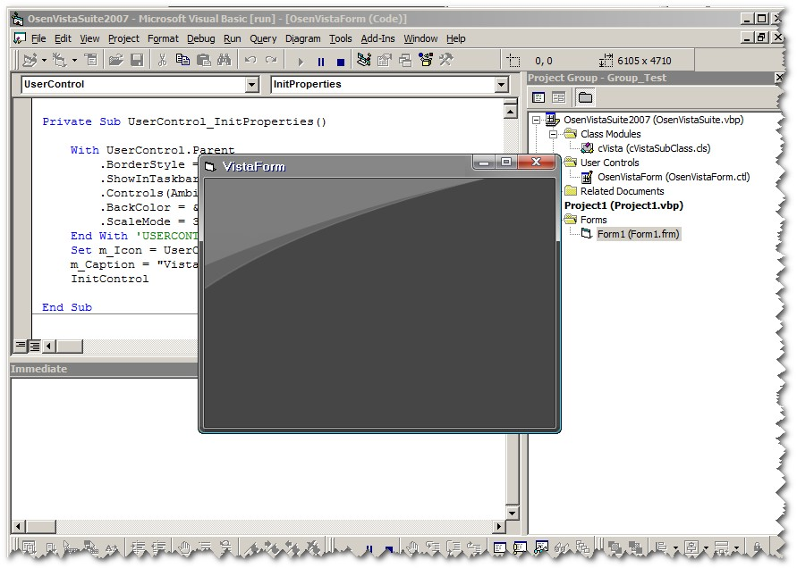



## The Real Vista Form Emulation Control \(OsenVistaForm\)

### Description

4 years ago, I was create Exactly Osen XP Form control, today I trying to write Vista Form Emulation control. Sugestion or comment are welcome ...
 
### More Info
 

             |
---                |---
**Submitted On**   |2007-08-16 12:29:08
**By**             |[Osen Kusnadi\.](https://github.com/Planet-Source-Code/PSCIndex/blob/master/ByAuthor/osen-kusnadi.md)
**Level**          |Intermediate
**User Rating**    |4.8 (63 globes from 13 users)
**Compatibility**  |VB 6\.0
**Category**       |[Custom Controls/ Forms/  Menus](https://github.com/Planet-Source-Code/PSCIndex/blob/master/ByCategory/custom-controls-forms-menus__1-4.md)
**World**          |[Visual Basic](https://github.com/Planet-Source-Code/PSCIndex/blob/master/ByWorld/visual-basic.md)
**Archive File**   |[The\_Real\_V2079708162007\.zip](https://github.com/Planet-Source-Code/osen-kusnadi-the-real-vista-form-emulation-control-osenvistaform__1-69162/archive/master.zip)

